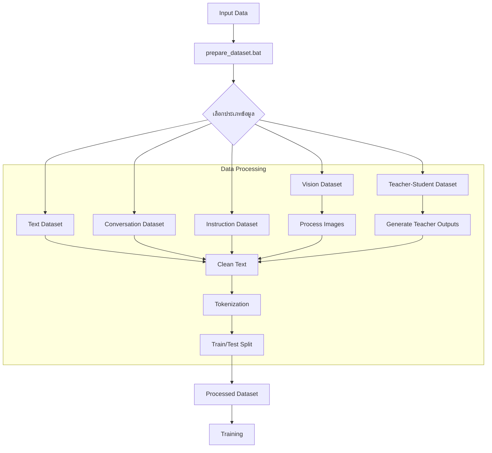
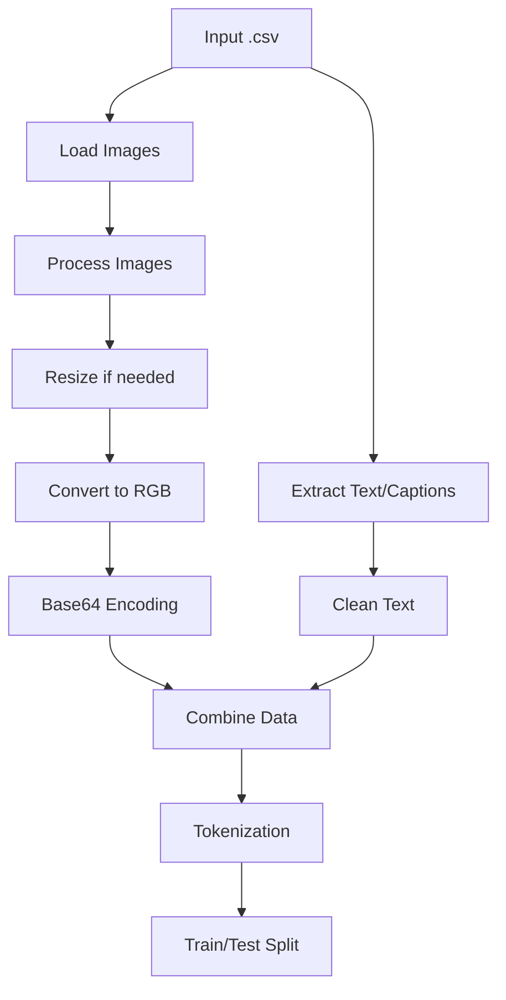
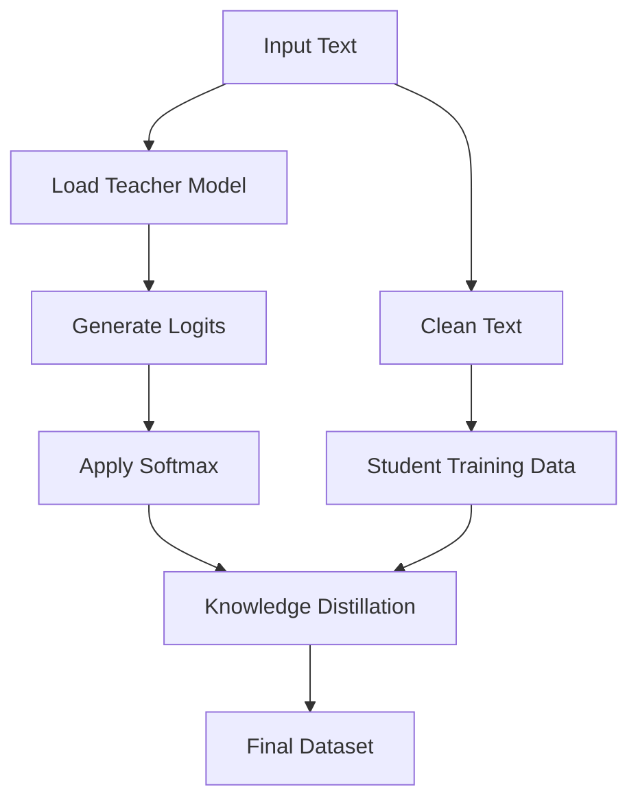

# SCB10X Typhoon-7B Model Fine-tuning

โครงการปรับแต่งโมเดล Typhoon-7B ด้วยเทคนิคขั้นสูงจากงานวิจัยล่าสุด เพื่อให้มีความสามารถในการเข้าใจและตอบคำถามภาษาไทยได้ดียิ่งขึ้น

## Workflow Overview



## Text Dataset Workflow


## Conversation Dataset Workflow


## Vision Dataset Workflow



## Teacher-Student Learning Workflow



## คุณสมบัติหลัก

- ใช้เทคนิคจากโมเดลล่าสุด: LLaMA-3, Claude 3.5, Gemma, DeepSeek, Phi-3
- รองรับการปรับแต่งด้วย PEFT (LoRA, Prefix Tuning)
- ใช้เทคนิค QLoRA เพื่อลดการใช้หน่วยความจำ
- การปรับแต่งด้วย RLHF (Reinforcement Learning from Human Feedback)
- รองรับการเทรนแบบหลายขั้นตอน (Multi-stage Training)
- การเพิ่มประสิทธิภาพการอนุมานด้วย Flash Attention
- ชุดข้อมูลภาษาไทยจากหลายแหล่ง

## การติดตั้ง

```bash
# Clone โครงการ
git clone https://github.com/yourusername/Project-scb10xtyphoon-7b.git
cd Project-scb10xtyphoon-7b

# ติดตั้ง dependencies
pip install -r requirements.txt
```

## การใช้งาน

### การเทรนโมเดลพื้นฐาน

```bash
# สำหรับ Linux/Mac
./run_training.sh

# สำหรับ Windows
run_training.bat
```

### การเทรนโมเดลขั้นสูง

```bash
# สำหรับ Windows
run_advanced_training.bat --use_flash_attn --use_llama3

# สำหรับ Linux/Mac
python advanced_training.py --output_dir ./fine_tuned_typhoon_advanced --use_flash_attn --use_llama3
```

### การใช้งานโมเดลที่ปรับแต่งแล้ว

```bash
# โหมดสนทนาโต้ตอบ
python typhoon_inference.py --model_path ./fine_tuned_typhoon --interactive

# การประมวลผลไฟล์คำถาม
python typhoon_inference.py --model_path ./fine_tuned_typhoon --input_file questions.txt --output_file answers.txt
```

## เทคนิคที่ใช้ในโครงการ

- **DeepSeek Techniques**: LoRA ที่ปรับแต่งรูปแบบพิเศษ และการจัดการหน่วยความจำขั้นสูง
- **Meta AI**: Prefix Tuning แบบพิเศษจาก LLaMA-3
- **Anthropic**: Constitutional AI และเทคนิคจาก Claude 3.5
- **Microsoft**: Grouped-Query Attention (GQA) จาก Phi-3
- **Google**: Gated Mixture of Experts จาก Gemma
- **RWKV**: Linear Attention แบบไม่ใช้ attention matrix
- **EleutherAI**: Loss Adaptation เพื่อการเทรนที่มีประสิทธิภาพ
- **Mistral AI**: Sliding Window Attention เพื่อประมวลผลข้อความยาวได้อย่างมีประสิทธิภาพ

## ประเภทไฟล์

- `typhoon_model_training.py`: ไฟล์หลักสำหรับการเทรนโมเดล
- `typhoon_inference.py`: สำหรับการอนุมานและใช้งานโมเดล
- `data_preprocessing.py`: เตรียมและจัดการชุดข้อมูล
- `deepseek_utils.py`: เครื่องมือและฟังก์ชันจาก DeepSeek และงานวิจัยอื่นๆ
- `advanced_training.py`: การเทรนขั้นสูงที่รวมเทคนิคหลายอย่าง
- `run_training.sh` / `run_training.bat`: สคริปต์เริ่มการเทรนบน Linux/Windows
- `run_advanced_training.bat`: สคริปต์เริ่มการเทรนขั้นสูงบน Windows
- `run_inference.bat`: สคริปต์สำหรับการอนุมานบน Windows

## ข้อมูลอ้างอิง

- [SCB10X Typhoon-7B](https://huggingface.co/scb10x/typhoon-7b)
- [DeepSeek Research](https://www.deepseek.com/)
- [LLaMA-3 Technical Report](https://ai.meta.com/blog/meta-llama-3/)
- [Anthropic Claude 3.5 Technical Report](https://www.anthropic.com/claude)
- [EleutherAI Research](https://www.eleuther.ai/)
- [Microsoft Phi-3 Technical Report](https://www.microsoft.com/en-us/research/blog/phi-3-technical-report/)
