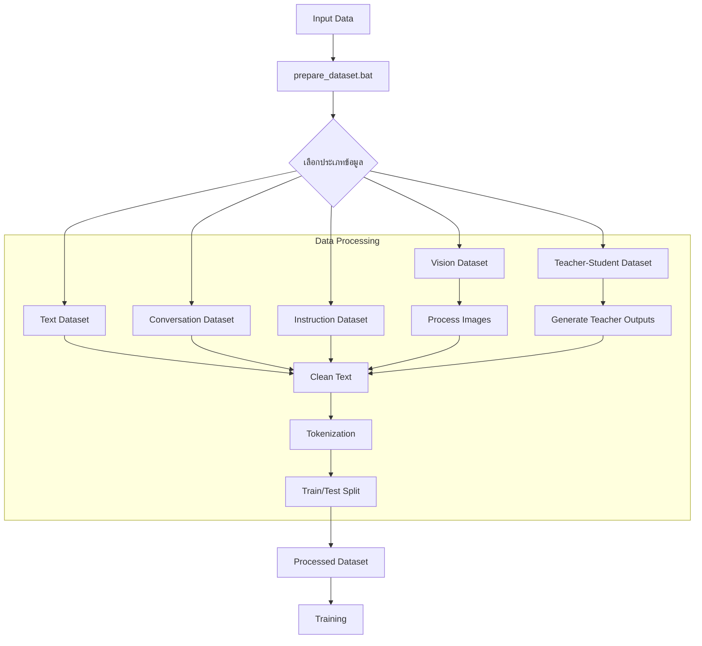
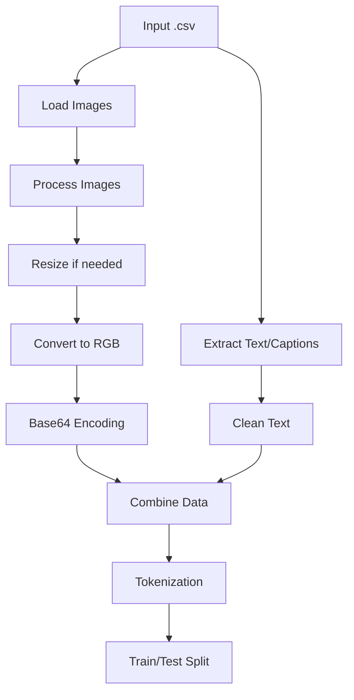
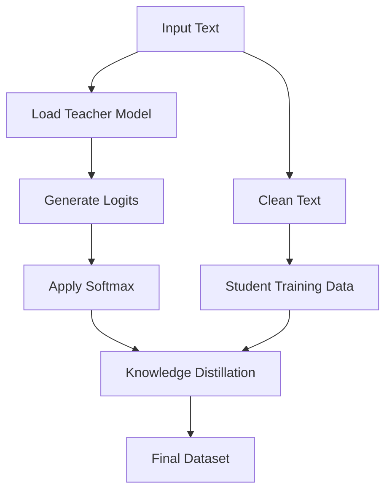

# SCB10X Typhoon-7B Model Fine-tuning

โครงการปรับแต่งโมเดล Typhoon-7B ด้วยเทคนิคขั้นสูงจากงานวิจัยล่าสุด เพื่อให้มีความสามารถในการเข้าใจและตอบคำถามภาษาไทยได้ดียิ่งขึ้น รวมถึงความสามารถในการประมวลผลภาพ (Vision Processing)

## Quick Start

```bash
# 1. ติดตั้ง
git clone https://github.com/yourusername/Project-scb10xtyphoon-7b.git
cd Project-scb10xtyphoon-7b
pip install -r requirements.txt

# 2. ดาวน์โหลดและเตรียมข้อมูล
prepare_training_data.bat  # หรือ ./prepare_training_data.sh สำหรับ Linux/Mac

# 3. เริ่มการเทรน
run_training.bat  # หรือ ./run_training.sh สำหรับ Linux/Mac
```

## ความสามารถหลัก

1. การประมวลผลภาษาไทย:
   - เข้าใจและตอบคำถามภาษาไทย
   - รองรับการสนทนาโต้ตอบ
   - ประมวลผลคำสั่งและให้ผลลัพธ์

2. การประมวลผลภาพ (Vision):
   - วิเคราะห์และอธิบายภาพเป็นภาษาไทย
   - สร้างภาพจากคำอธิบายภาษาไทย
   - ปรับปรุงคุณภาพภาพอัตโนมัติ

3. เทคนิคขั้นสูง:
   - Knowledge Distillation จาก OmniParser
   - Vision Processing ด้วย CLIP, SDXL, ControlNet
   - ใช้ Safetensors สำหรับความปลอดภัย

## Workflow Overview



## Text Dataset Workflow


## Conversation Dataset Workflow


## Vision Dataset Workflow



## Teacher-Student Learning Workflow



## คุณสมบัติหลัก

- ใช้เทคนิคจากโมเดลล่าสุด: LLaMA-3, Claude 3.5, Gemma, DeepSeek, Phi-3
- รองรับการปรับแต่งด้วย PEFT (LoRA, Prefix Tuning)
- ใช้เทคนิค QLoRA เพื่อลดการใช้หน่วยความจำ
- การปรับแต่งด้วย RLHF (Reinforcement Learning from Human Feedback)
- รองรับการเทรนแบบหลายขั้นตอน (Multi-stage Training)
- การเพิ่มประสิทธิภาพการอนุมานด้วย Flash Attention
- ชุดข้อมูลภาษาไทยจากหลายแหล่ง

## การติดตั้ง

```bash
# Clone โครงการ
git clone https://github.com/yourusername/Project-scb10xtyphoon-7b.git
cd Project-scb10xtyphoon-7b

# ติดตั้ง dependencies
pip install -r requirements.txt
```

## การเตรียมข้อมูลสำหรับการเทรน

### ดาวน์โหลดและเตรียมข้อมูลอัตโนมัติ
```bash
# สำหรับ Windows
prepare_training_data.bat
```

ระบบจะดาวน์โหลดและเตรียมข้อมูลจาก Hugging Face ดังนี้:

1. ข้อความภาษาไทย:
   - Thai Wikipedia (20230601.th)
   - ThaiGPT4 dataset

2. บทสนทนา:
   - BELLE Thai dataset
   - Thai Alpaca dataset

3. ข้อมูลภาพ:
   - LAION Thai subset
   - Thai Art dataset

4. คำสั่งและการตอบสนอง:
   - ThaiInstruct dataset
   - Thai Dolly dataset

ข้อมูลที่ดาวน์โหลดจะถูกเก็บใน `datasets/` และข้อมูลที่ผ่านการประมวลผลแล้วจะอยู่ใน `processed_data/`

### การเตรียมข้อมูลด้วยตนเอง
สามารถเตรียมข้อมูลแต่ละประเภทได้ด้วยคำสั่ง:
```bash
# ข้อความทั่วไป
python data_preprocessing.py --input_file input.txt --input_type text --dataset_type text

# บทสนทนา
python data_preprocessing.py --input_file chat.csv --input_type csv --dataset_type conversation

# ข้อมูลภาพ
python data_preprocessing.py --input_file images.csv --input_type csv --dataset_type vision --image_column image --caption_column caption

# คำสั่งและการตอบสนอง
python data_preprocessing.py --input_file instructions.json --input_type json --dataset_type instruction
```

## การใช้งาน

### การเทรนโมเดลพื้นฐาน

```bash
# สำหรับ Linux/Mac
./run_training.sh

# สำหรับ Windows
run_training.bat
```

### การเทรนโมเดลขั้นสูง (Text)

```bash
# สำหรับ Windows
run_advanced_training.bat --use_flash_attn --use_llama3

# สำหรับ Linux/Mac
python advanced_training.py --output_dir ./fine_tuned_typhoon_advanced --use_flash_attn --use_llama3
```

### การเทรนโมเดล Vision ขั้นสูง

```bash
# สำหรับ Windows
train_vision_model.bat
```

สคริปต์นี้จะให้คุณเลือก configuration การเทรน:
1. Basic: ใช้ค่าเริ่มต้น
2. Advanced: เปิดใช้งานเทคนิคพิเศษทั้งหมด
3. Custom: เลือกเทคนิคที่ต้องการ

เทคนิคพิเศษที่ใช้ในการเทรน Vision Model:
- Flash Attention (Meta AI)
- Advanced Schedulers (Anthropic, Stability AI)
- Improved VAE (DeepMind)
- Token Merging (EleutherAI)
- Selective State Updates (Microsoft)
- 8-bit Adam Optimizer (Meta AI)
- Constitutional AI Checks (Anthropic)

### การใช้งานโมเดลที่ปรับแต่งแล้ว

```bash
# โหมดสนทนาโต้ตอบ
python typhoon_inference.py --model_path ./fine_tuned_typhoon --interactive

# การประมวลผลไฟล์คำถาม
python typhoon_inference.py --model_path ./fine_tuned_typhoon --input_file questions.txt --output_file answers.txt
```

## เทคนิคที่ใช้ในโครงการ

- **DeepSeek Techniques**: LoRA ที่ปรับแต่งรูปแบบพิเศษ และการจัดการหน่วยความจำขั้นสูง
- **Meta AI**: Prefix Tuning แบบพิเศษจาก LLaMA-3
- **Anthropic**: Constitutional AI และเทคนิคจาก Claude 3.5
- **Microsoft**: Grouped-Query Attention (GQA) จาก Phi-3
- **Google**: Gated Mixture of Experts จาก Gemma
- **RWKV**: Linear Attention แบบไม่ใช้ attention matrix
- **EleutherAI**: Loss Adaptation เพื่อการเทรนที่มีประสิทธิภาพ
- **Mistral AI**: Sliding Window Attention เพื่อประมวลผลข้อความยาวได้อย่างมีประสิทธิภาพ

## โครงสร้าง Output

ผลลัพธ์ทั้งหมดจะถูกเก็บในโฟลเดอร์ `outputs/` ตามโครงสร้างนี้:

```
outputs/
├── models/               # โมเดลที่เทรนเสร็จแล้ว
│   ├── text/             # โมเดล Text
│   │   └── typhoon_advanced_YYYYMMDD_HHMMSS/
│   │       ├── model_info.txt
│   │       ├── config.json
│   │       └── pytorch_model.bin (or safetensors)
│   └── vision/           # โมเดล Vision
│       └── checkpoints/
│           └── vision_model_epoch_X/
│               ├── config.json
│               └── diffusion_pytorch_model.safetensors
├── logs/                 # ไฟล์ Log
│   ├── data_preprocessing/
│   │   └── data_preprocessing.log
│   ├── text_training/
│   │   └── advanced_training.log
│   └── vision_training/
│       └── vision_training.log
├── processed_data/       # ข้อมูลที่ผ่านการประมวลผล
│   ├── text/
│   │   └── wikipedia/
│   │   └── gpt4/
│   ├── conversation/
│   │   └── belle/
│   │   └── alpaca/
│   ├── vision/
│   │   └── laion/
│   │   └── art/
│   └── instruction/
│       └── instruct/
│       └── dolly/
└── evaluation/           # ผลการประเมินโมเดล (ถ้ามี)
```

## ประเภทไฟล์

- `typhoon_model_training.py`: ไฟล์หลักสำหรับการเทรนโมเดล Text พื้นฐาน
- `advanced_training.py`: การเทรนโมเดล Text ขั้นสูง
- `vision_training.py`: การเทรนโมเดล Vision ขั้นสูง
- `typhoon_inference.py`: สำหรับการอนุมานและใช้งานโมเดล
- `data_preprocessing.py`: เตรียมและจัดการชุดข้อมูล
- `download_datasets.py`: ดาวน์โหลดข้อมูลจาก Hugging Face
- `vision_utils.py`: เครื่องมือสำหรับ Vision Processing และ Generation
- `deepseek_utils.py`: เครื่องมือและฟังก์ชันจาก DeepSeek และงานวิจัยอื่นๆ
- `run_training.bat`: สคริปต์เริ่มการเทรน Text พื้นฐาน (Windows)
- `run_advanced_training.bat`: สคริปต์เริ่มการเทรน Text ขั้นสูง (Windows)
- `train_vision_model.bat`: สคริปต์เริ่มการเทรน Vision (Windows)
- `prepare_training_data.bat`: สคริปต์ดาวน์โหลดและเตรียมข้อมูล (Windows)
- `run_inference.bat`: สคริปต์สำหรับการอนุมาน (Windows)

## ข้อมูลอ้างอิง

- [SCB10X Typhoon-7B](https://huggingface.co/scb10x/typhoon-7b)
- [DeepSeek Research](https://www.deepseek.com/)
- [LLaMA-3 Technical Report](https://ai.meta.com/blog/meta-llama-3/)
- [Anthropic Claude 3.5 Technical Report](https://www.anthropic.com/claude)
- [EleutherAI Research](https://www.eleuther.ai/)
- [Microsoft Phi-3 Technical Report](https://www.microsoft.com/en-us/research/blog/phi-3-technical-report/)

## Latest Updates (2025/04)

1. Vision Features:
   - เพิ่มความสามารถในการประมวลผลภาพ
   - รองรับการสร้างภาพด้วย SDXL
   - เพิ่ม ControlNet สำหรับควบคุมการสร้างภาพ
   - ปรับปรุงคุณภาพภาพอัตโนมัติ

2. Training Data:
   - เพิ่มการดาวน์โหลดข้อมูลจาก Hugging Face
   - เพิ่มชุดข้อมูล Vision ภาษาไทย
   - รองรับ Safetensors format

3. Performance:
   - ปรับปรุงประสิทธิภาพการประมวลผล
   - เพิ่มความเร็วในการเทรน
   - ลดการใช้หน่วยความจำ

## Contact & Support

- Email: zombitx64@gmail.com
- GitHub Issues: สำหรับรายงานปัญหาและข้อเสนอแนะ
- Documentation: ดูเพิ่มเติมที่โฟลเดอร์ docs/

## License

MIT License - see [LICENSE](LICENSE) file for details.
